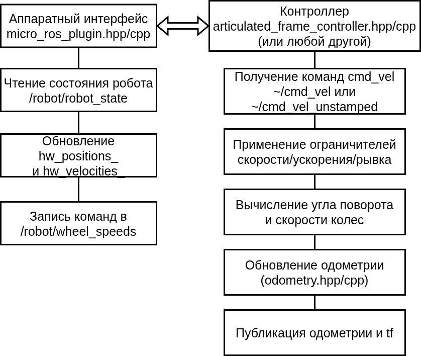

# Articulated Frame Controller for ROS2 Control

## Общее описание

Данный пакет представляет собой аппаратный интерфейс для связи с микроконтроллером через microros. Основан на https://github.com/ros-controls/gz_ros2_control.

### MicroRos2SystemHardware

Аппаратный интерфейс обеспечивает связь между ROS2 Control и физическим роботом через microros. Основные функции:

- Двусторонняя связь: подписка на топик /robot/robot_state для получения состояния робота и публикация в топик /robot/wheel_speeds для отправки команд управления
- Преобразование данных: конвертация данных из формата Int16MultiArray в значения скорости и позиции суставов
- Интеграция позиции: вычисление текущей позиции суставов на основе полученных скоростей
- Жизненный цикл: реализация стандартных методов ros2_control (on_init, on_activate, on_deactivate, read, write)

## Взаимодействие компонентов

## Требования к аппаратной части
Аппаратный интерфейс ожидает:
- Подписку на топик /robot/robot_state с типом Int16MultiArray, где данные содержат информацию о состоянии суставов
- Публикацию в топик /robot/wheel_speeds с типом Int16MultiArray для управления моторами